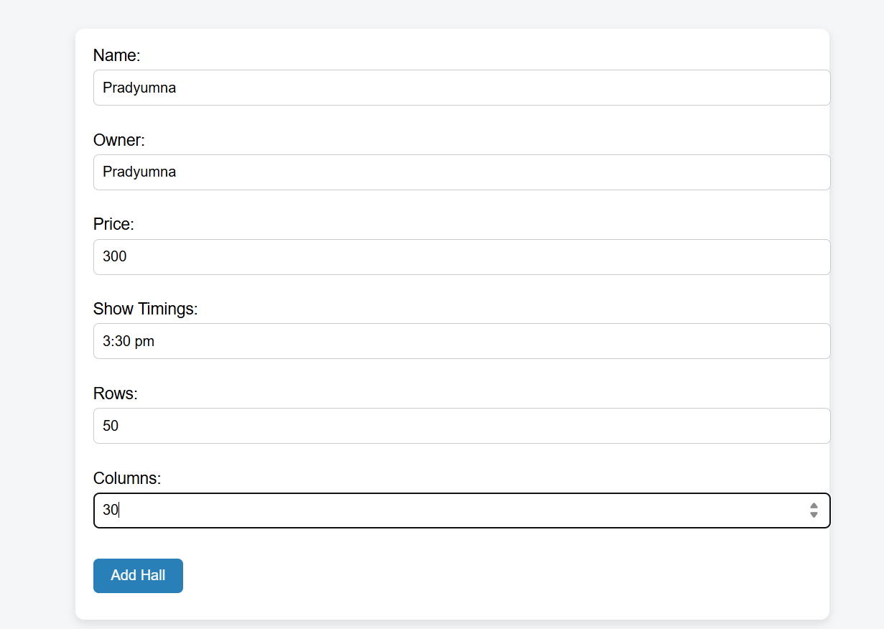
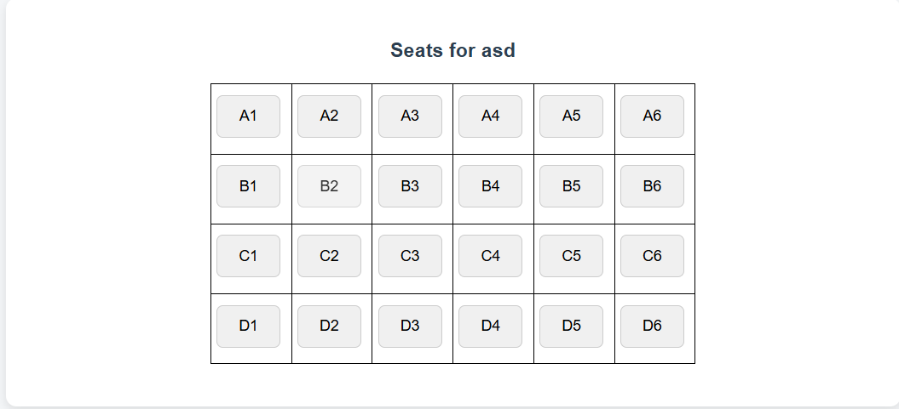
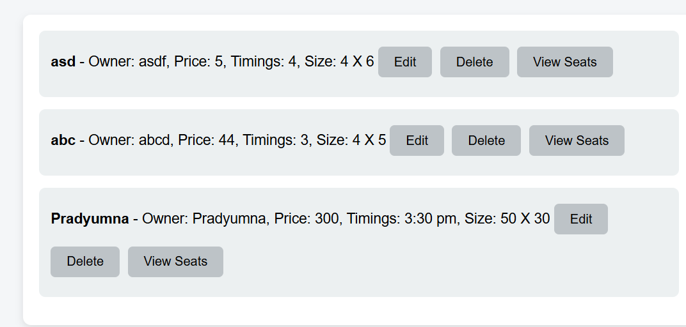
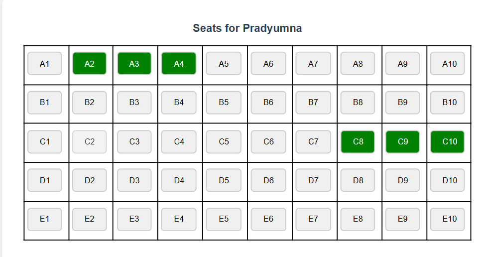

# Movie Hall Booking System

## Live Demo

[Click here to view the live project](https://pradyumnadevulapally.github.io/Movie-Hall/)

This is a simple seat booking and hall management system built using **Vanilla JavaScript**, **HTML**, and **CSS**. It allows users to create movie halls, define show details, and manage seat bookings interactively.

---

## Features

- Add new movie halls with:
  - Hall name
  - Owner
  - Ticket price
  - Show timings
  - Hall size (rows × columns)
- View all halls in a list
- Edit or delete any hall
- Book or unbook individual seats (stored in `localStorage`)
- Color-coded seat status (booked vs. available)

---

## Screenshots

| Booking Layout | Form Interface | Hall Listing | Seat View |
|----------------|----------------|--------------|-----------|
|  |  |  |  |

---

## Tech Stack

- HTML5
- CSS3
- JavaScript (ES6)
- `localStorage` for data persistence

---

## How to Run the Project

1. Clone the repository:

  git clone https://github.com/PradyumnaDevulapally/Movie-Hall.git

2. Navigate to the folder:

  cd Movie-Hall

3. Open `index.html` in your browser.

---

## Author

**D.V. Satya Pradyumna**  
Final-year CSE Student

---

## License

This project is for educational/demo purposes. No license attached.
